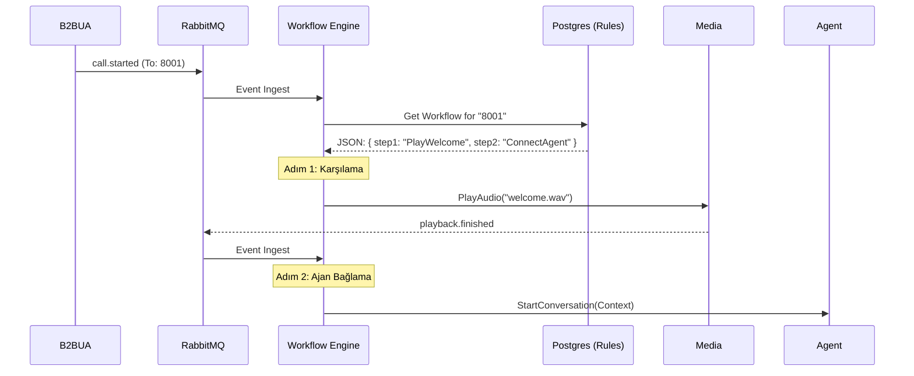

# 🧠 Workflow Service - Mantık Mimarisi (The Cortex)

**Rol:** Merkezi Karar Motoru ve Süreç Yöneticisi.

## 1. Mimari: Olay Güdümlü Durum Makinesi (Event-Driven State Machine)

Bu servis, statik kod yerine, veritabanında saklanan **JSON Akış Şemalarını** (Blueprints) çalıştırır.

### Çekirdek Döngüsü

1.  **Trigger:** RabbitMQ'dan bir olay gelir (Örn: `call.started`, `dtmf.received`).
2.  **Fetch:** `call_id` kullanılarak Redis'ten aktif oturum (`Session`) çekilir.
3.  **Engine:** Mevcut adımdaki (`CurrentStep`) kurallar, gelen olayla karşılaştırılır.
4.  **Transition:** Eğer kural eşleşirse, bir sonraki adıma (`NextStep`) geçilir.
5.  **Action:** Yeni adımın gerektirdiği emir (gRPC) ilgili servise gönderilir.

## 2. Akış Diyagramı



## 3. JSON Şema Yapısı

```json
{
  "id": "wf_support",
  "steps": {
    "welcome": {
      "type": "play",
      "file": "intro.wav",
      "next": "menu"
    },
    "menu": {
      "type": "input_dtmf",
      "timeout": 5,
      "branches": {
        "1": "sales_flow",
        "2": "support_flow"
      }
    }
  }
}
```

---
