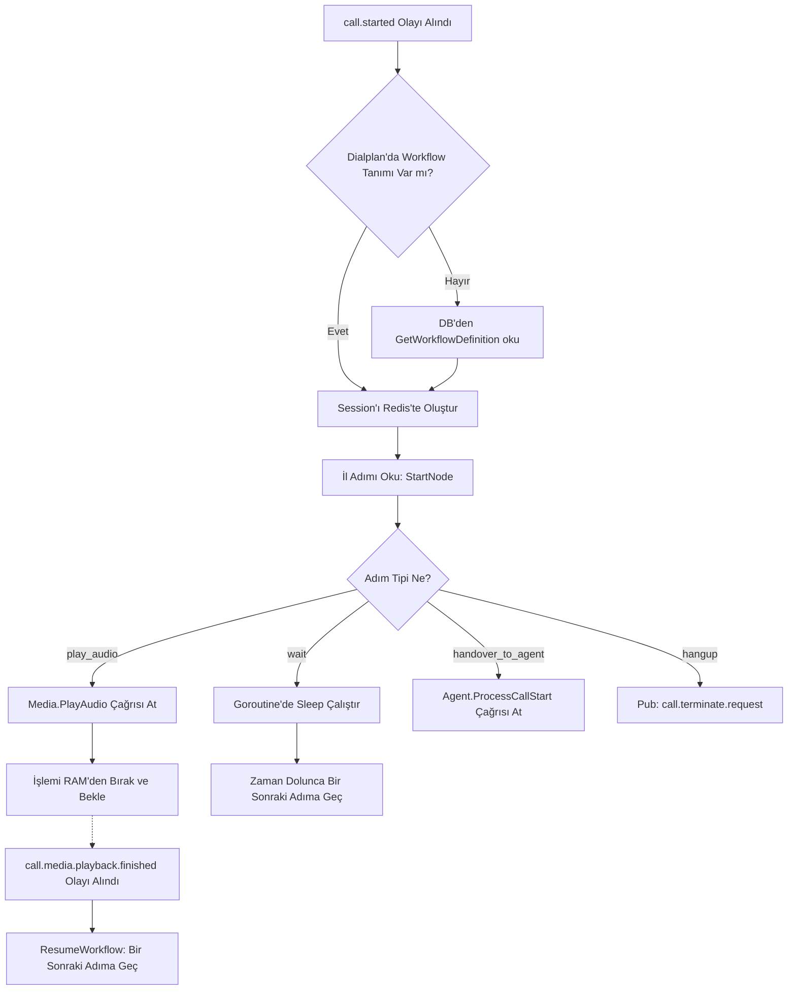

# 🧬 Workflow SAGA & State Machine Logic

Bu belge, `workflow-service`'in RabbitMQ'dan gelen olaylara göre çağrı yaşam döngüsünü (SAGA) nasıl yönettiğini açıklar.

## 1. Dağıtık İşlem Yönetimi (SAGA Pattern)
Telefon çağrıları asenkron ve uzun süren (Long-running) işlemlerdir. Sistem, her olayı (`call.started`, `call.media.playback.finished`) dinleyerek bir sonraki adıma geçer.

## 2. İş Akışı Adım Motoru (Diyagram)
Aşağıdaki diyagram, `dialplan-service`'den gelen bir JSON akışının nasıl icra edildiğini gösterir:

```mermaid
graph TD
    A[call.started Olayı Alındı] --> B{Dialplan'da Workflow Tanımı Var mı?}
    B -- Hayır --> C[DB'den GetWorkflowDefinition oku]
    B -- Evet --> D[Session'ı Redis'te Oluştur]
    C --> D
    
    D --> E[İl Adımı Oku: StartNode]
    E --> F{Adım Tipi Ne?}
    
    F -- play_audio --> G[Media.PlayAudio Çağrısı At]
    G --> H[İşlemi RAM'den Bırak ve Bekle]
    
    F -- wait --> I[Goroutine'de Sleep Çalıştır]
    I --> J[Zaman Dolunca Bir Sonraki Adıma Geç]
    
    F -- handover_to_agent --> K[Agent.ProcessCallStart Çağrısı At]
    
    F -- hangup --> L[Pub: call.terminate.request]
    
    H -.-> M[call.media.playback.finished Olayı Alındı]
    M --> N[ResumeWorkflow: Bir Sonraki Adıma Geç]
```

## 3. State Store (Redis & PostgreSQL)
* **Canlı Durum (Redis):** Çağrı durumu geçici ve hızlı değiştiği için `wf_session:[call_id]` anahtarı altında Redis Hash olarak tutulur.
* **Arşiv (Postgres):** Çağrı bittiğinde, idempotent kilit (`HSETNX is_archived`) kullanılarak son durum `workflow_execution_logs` tablosuna tek seferlik denetim (Audit) logu olarak yazılır.
